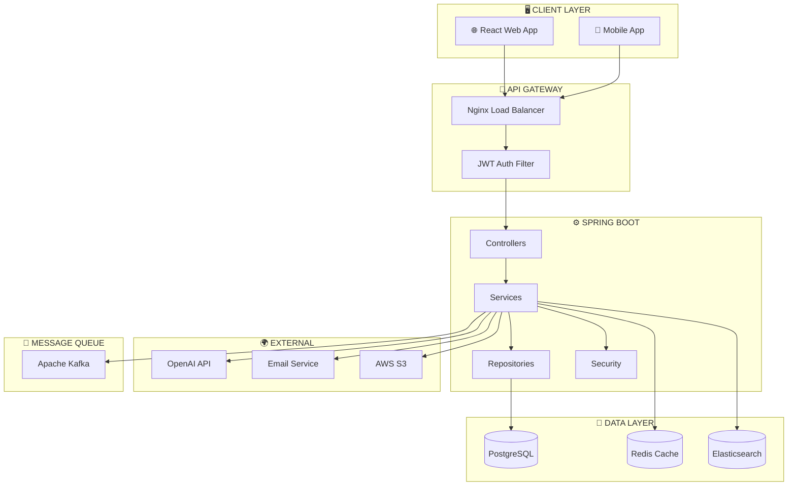
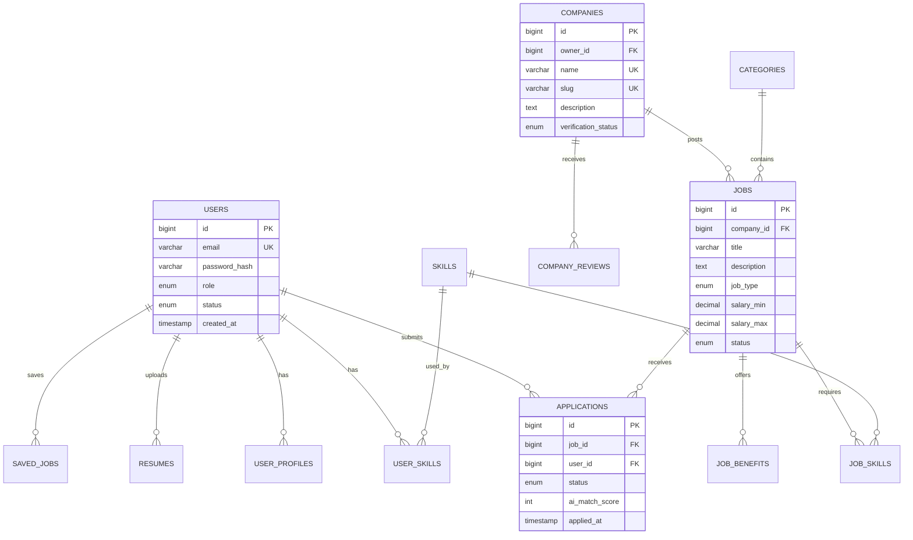
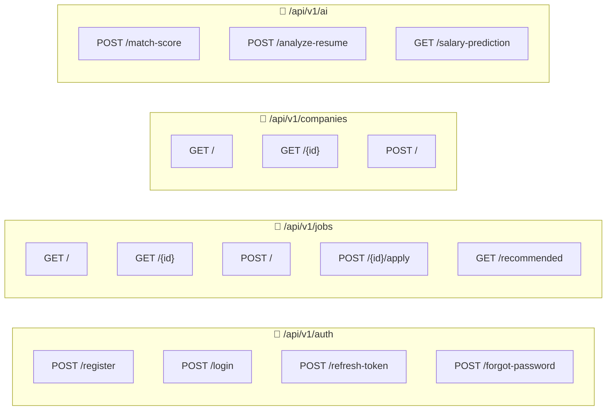
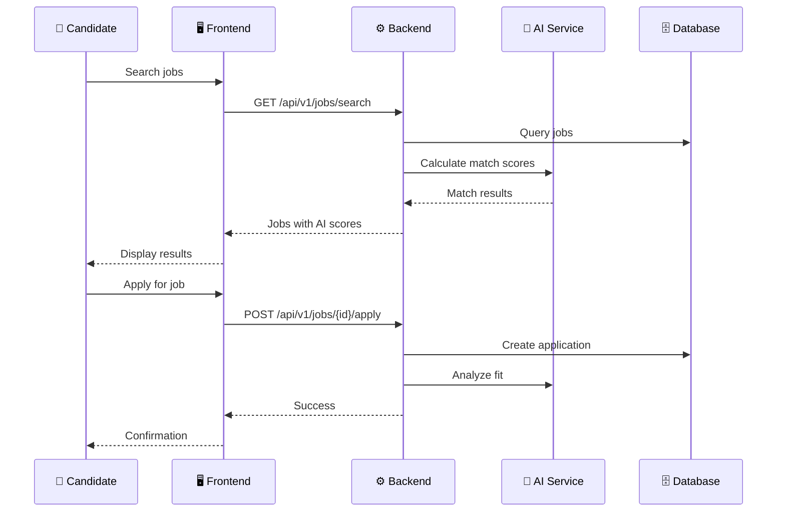
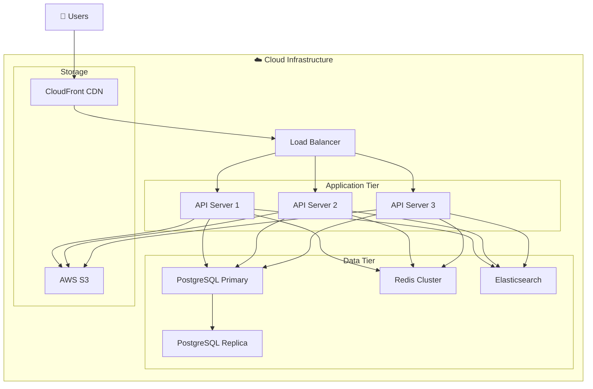

# 📊 JobVerse - System Diagrams

## 1. System Architecture



---

## 2. Database ERD (Entity Relationship Diagram)



---

## 3. API Endpoints Structure



---

## 4. Application Flow



---

## 5. Project Structure

```
jobverse-backend/
├── src/main/java/com/jobverse/
│   ├── config/           # Security, Redis, Kafka configs
│   ├── controller/       # REST API endpoints
│   ├── service/          # Business logic
│   ├── repository/       # Data access layer
│   ├── entity/           # JPA entities
│   ├── dto/              # Request/Response DTOs
│   ├── security/         # JWT, Auth
│   └── exception/        # Error handling
├── src/main/resources/
│   ├── application.yml   # Configuration
│   └── db/migration/     # Flyway SQL
├── docker-compose.yml    # All services
├── Dockerfile           
└── pom.xml              # Dependencies
```

---

## 6. Tech Stack Overview

| Layer | Technology |
|-------|------------|
| Frontend | React 18 + Vite + Tailwind CSS |
| Backend | Spring Boot 3.2 + Java 17 |
| Database | PostgreSQL 16 |
| Cache | Redis 7 |
| Search | Elasticsearch 8 |
| Queue | Apache Kafka |
| Auth | JWT + OAuth2 |
| AI | OpenAI GPT-4 |
| Storage | AWS S3 |
| Container | Docker + Docker Compose |

---

## 7. Deployment Architecture


