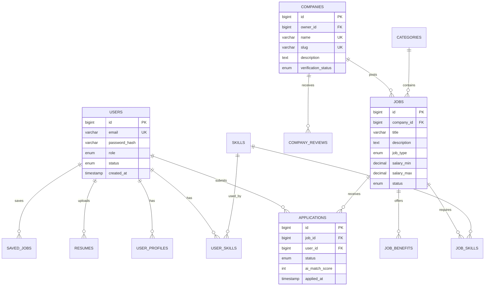

# 📊 JobVerse - System Diagrams

## 1. System Architecture


---

## 2. Database ERD (Entity Relationship Diagram)



---

## 3. API Endpoints Structure


---

## 4. Application Flow

```mermaid
sequenceDiagram
    participant C as 👤 Candidate
    participant FE as 🖥️ Frontend
    participant API as ⚙️ Backend
    participant AI as 🤖 AI Service
    participant DB as 🗄️ Database

    C->>FE: Search jobs
    FE->>API: GET /api/v1/jobs/search
    API->>DB: Query jobs
    API->>AI: Calculate match scores
    AI-->>API: Match results
    API-->>FE: Jobs with AI scores
    FE-->>C: Display results

    C->>FE: Apply for job
    FE->>API: POST /api/v1/jobs/{id}/apply
    API->>DB: Create application
    API->>AI: Analyze fit
    API-->>FE: Success
    FE-->>C: Confirmation
```



---

## 5. Project Structure

```
jobverse-backend/
├── src/main/java/com/jobverse/
│   ├── config/           # Security, Redis, Kafka configs
│   ├── controller/       # REST API endpoints
│   ├── service/          # Business logic
│   ├── repository/       # Data access layer
│   ├── entity/           # JPA entities
│   ├── dto/              # Request/Response DTOs
│   ├── security/         # JWT, Auth
│   └── exception/        # Error handling
├── src/main/resources/
│   ├── application.yml   # Configuration
│   └── db/migration/     # Flyway SQL
├── docker-compose.yml    # All services
├── Dockerfile           
└── pom.xml              # Dependencies
```

---

## 6. Tech Stack Overview

| Layer | Technology |
|-------|------------|
| Frontend | React 18 + Vite + Tailwind CSS |
| Backend | Spring Boot 3.2 + Java 17 |
| Database | PostgreSQL 16 |
| Cache | Redis 7 |
| Search | Elasticsearch 8 |
| Queue | Apache Kafka |
| Auth | JWT + OAuth2 |
| AI | OpenAI GPT-4 |
| Storage | AWS S3 |
| Container | Docker + Docker Compose |

---

## 7. Deployment Architecture

```mermaid
flowchart TB
    subgraph Cloud["☁️ Cloud Infrastructure"]
        LB["Load Balancer"]
        
        subgraph App["Application Tier"]
            API1["API Server 1"]
            API2["API Server 2"]
            API3["API Server 3"]
        end
        
        subgraph Data["Data Tier"]
            PG["PostgreSQL Primary"]
            PG_R["PostgreSQL Replica"]
            REDIS["Redis Cluster"]
            ES["Elasticsearch"]
        end
        
        subgraph Storage["Storage"]
            S3["AWS S3"]
            CDN["CloudFront CDN"]
        end
    end
    
    Users["👥 Users"] --> CDN
    CDN --> LB
    LB --> API1 & API2 & API3
    API1 & API2 & API3 --> PG & REDIS & ES
    PG --> PG_R
    API1 & API2 & API3 --> S3
```


