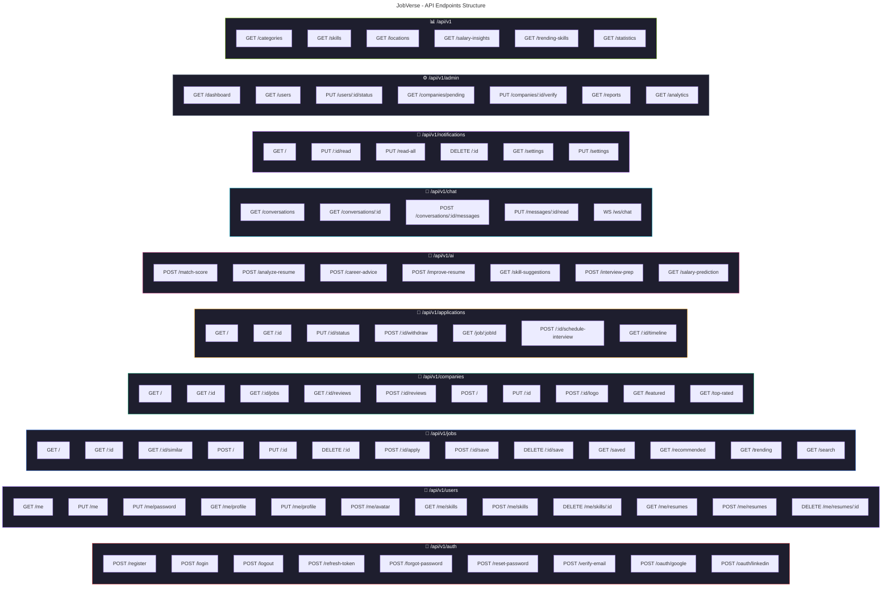

```mermaid
---
title: JobVerse - API Endpoints Structure
---
flowchart LR
    subgraph AUTH["🔐 /api/v1/auth"]
        A1["POST /register"]
        A2["POST /login"]
        A3["POST /logout"]
        A4["POST /refresh-token"]
        A5["POST /forgot-password"]
        A6["POST /reset-password"]
        A7["POST /verify-email"]
        A8["POST /oauth/google"]
        A9["POST /oauth/linkedin"]
    end

    subgraph USERS["👤 /api/v1/users"]
        U1["GET /me"]
        U2["PUT /me"]
        U3["PUT /me/password"]
        U4["GET /me/profile"]
        U5["PUT /me/profile"]
        U6["POST /me/avatar"]
        U7["GET /me/skills"]
        U8["POST /me/skills"]
        U9["DELETE /me/skills/:id"]
        U10["GET /me/resumes"]
        U11["POST /me/resumes"]
        U12["DELETE /me/resumes/:id"]
    end

    subgraph JOBS["💼 /api/v1/jobs"]
        J1["GET /"]
        J2["GET /:id"]
        J3["GET /:id/similar"]
        J4["POST /"]
        J5["PUT /:id"]
        J6["DELETE /:id"]
        J7["POST /:id/apply"]
        J8["POST /:id/save"]
        J9["DELETE /:id/save"]
        J10["GET /saved"]
        J11["GET /recommended"]
        J12["GET /trending"]
        J13["GET /search"]
    end

    subgraph COMPANIES["🏢 /api/v1/companies"]
        C1["GET /"]
        C2["GET /:id"]
        C3["GET /:id/jobs"]
        C4["GET /:id/reviews"]
        C5["POST /:id/reviews"]
        C6["POST /"]
        C7["PUT /:id"]
        C8["POST /:id/logo"]
        C9["GET /featured"]
        C10["GET /top-rated"]
    end

    subgraph APPLICATIONS["📝 /api/v1/applications"]
        AP1["GET /"]
        AP2["GET /:id"]
        AP3["PUT /:id/status"]
        AP4["POST /:id/withdraw"]
        AP5["GET /job/:jobId"]
        AP6["POST /:id/schedule-interview"]
        AP7["GET /:id/timeline"]
    end

    subgraph AI["🤖 /api/v1/ai"]
        AI1["POST /match-score"]
        AI2["POST /analyze-resume"]
        AI3["POST /career-advice"]
        AI4["POST /improve-resume"]
        AI5["GET /skill-suggestions"]
        AI6["POST /interview-prep"]
        AI7["GET /salary-prediction"]
    end

    subgraph CHAT["💬 /api/v1/chat"]
        CH1["GET /conversations"]
        CH2["GET /conversations/:id"]
        CH3["POST /conversations/:id/messages"]
        CH4["PUT /messages/:id/read"]
        CH5["WS /ws/chat"]
    end

    subgraph NOTIFICATIONS["🔔 /api/v1/notifications"]
        N1["GET /"]
        N2["PUT /:id/read"]
        N3["PUT /read-all"]
        N4["DELETE /:id"]
        N5["GET /settings"]
        N6["PUT /settings"]
    end

    subgraph ADMIN["⚙️ /api/v1/admin"]
        AD1["GET /dashboard"]
        AD2["GET /users"]
        AD3["PUT /users/:id/status"]
        AD4["GET /companies/pending"]
        AD5["PUT /companies/:id/verify"]
        AD6["GET /reports"]
        AD7["GET /analytics"]
    end

    subgraph MISC["📊 /api/v1"]
        M1["GET /categories"]
        M2["GET /skills"]
        M3["GET /locations"]
        M4["GET /salary-insights"]
        M5["GET /trending-skills"]
        M6["GET /statistics"]
    end

    style AUTH fill:#1e1e2e,stroke:#ef4444,color:#fff
    style USERS fill:#1e1e2e,stroke:#8b5cf6,color:#fff
    style JOBS fill:#1e1e2e,stroke:#3b82f6,color:#fff
    style COMPANIES fill:#1e1e2e,stroke:#10b981,color:#fff
    style APPLICATIONS fill:#1e1e2e,stroke:#f59e0b,color:#fff
    style AI fill:#1e1e2e,stroke:#ec4899,color:#fff
    style CHAT fill:#1e1e2e,stroke:#06b6d4,color:#fff
    style NOTIFICATIONS fill:#1e1e2e,stroke:#a855f7,color:#fff
    style ADMIN fill:#1e1e2e,stroke:#64748b,color:#fff
    style MISC fill:#1e1e2e,stroke:#84cc16,color:#fff
```
