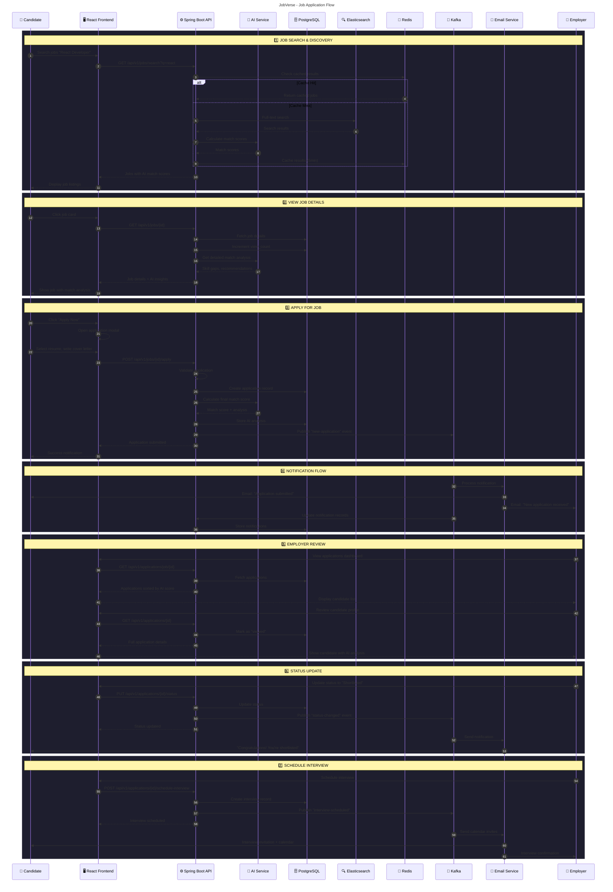

```mermaid
---
title: JobVerse - Job Application Flow
---
sequenceDiagram
    autonumber
    participant C as 👤 Candidate
    participant FE as 🖥️ React Frontend
    participant API as ⚙️ Spring Boot API
    participant AI as 🤖 AI Service
    participant DB as 🗄️ PostgreSQL
    participant ES as 🔍 Elasticsearch
    participant CACHE as 🔴 Redis
    participant QUEUE as 📨 Kafka
    participant EMAIL as 📧 Email Service
    participant E as 🏢 Employer

    rect rgb(30, 30, 46)
        Note over C,E: 1️⃣ JOB SEARCH & DISCOVERY
        C->>FE: Search jobs "React Developer"
        FE->>API: GET /api/v1/jobs/search?q=react
        API->>CACHE: Check cached results
        alt Cache Hit
            CACHE-->>API: Return cached jobs
        else Cache Miss
            API->>ES: Full-text search
            ES-->>API: Search results
            API->>AI: Calculate match scores
            AI-->>API: Match scores
            API->>CACHE: Cache results (5min)
        end
        API-->>FE: Jobs with AI match scores
        FE-->>C: Display job listings
    end

    rect rgb(30, 30, 46)
        Note over C,E: 2️⃣ VIEW JOB DETAILS
        C->>FE: Click job card
        FE->>API: GET /api/v1/jobs/{id}
        API->>DB: Fetch job details
        API->>DB: Increment view_count
        API->>AI: Get detailed match analysis
        AI-->>API: Skill gaps, recommendations
        API-->>FE: Job details + AI insights
        FE-->>C: Show job with match analysis
    end

    rect rgb(30, 30, 46)
        Note over C,E: 3️⃣ APPLY FOR JOB
        C->>FE: Click "Apply Now"
        FE->>FE: Open application modal
        C->>FE: Select resume, write cover letter
        FE->>API: POST /api/v1/jobs/{id}/apply
        API->>API: Validate application
        API->>DB: Create application record
        API->>AI: Calculate final match score
        AI-->>API: Match score + analysis
        API->>DB: Store AI analysis
        API->>QUEUE: Publish "new-application" event
        API-->>FE: Application submitted
        FE-->>C: Success notification
    end

    rect rgb(30, 30, 46)
        Note over C,E: 4️⃣ NOTIFICATION FLOW
        QUEUE->>EMAIL: Process notification
        EMAIL->>C: Email: "Application submitted"
        EMAIL->>E: Email: "New application received"
        QUEUE->>API: Update notification records
        API->>DB: Store notifications
    end

    rect rgb(30, 30, 46)
        Note over C,E: 5️⃣ EMPLOYER REVIEW
        E->>FE: View applications dashboard
        FE->>API: GET /api/v1/applications/job/{id}
        API->>DB: Fetch applications
        API-->>FE: Applications sorted by AI score
        FE-->>E: Display candidate list
        
        E->>FE: Review candidate profile
        FE->>API: GET /api/v1/applications/{id}
        API->>DB: Mark as "viewed"
        API-->>FE: Full application details
        FE-->>E: Show candidate with AI analysis
    end

    rect rgb(30, 30, 46)
        Note over C,E: 6️⃣ STATUS UPDATE
        E->>FE: Update status to "Shortlisted"
        FE->>API: PUT /api/v1/applications/{id}/status
        API->>DB: Update status
        API->>QUEUE: Publish "status-changed" event
        API-->>FE: Status updated
        QUEUE->>EMAIL: Send notification
        EMAIL->>C: "Congratulations! You're shortlisted"
    end

    rect rgb(30, 30, 46)
        Note over C,E: 7️⃣ SCHEDULE INTERVIEW
        E->>FE: Schedule interview
        FE->>API: POST /api/v1/applications/{id}/schedule-interview
        API->>DB: Create interview record
        API->>QUEUE: Publish "interview-scheduled"
        API-->>FE: Interview scheduled
        QUEUE->>EMAIL: Send calendar invites
        EMAIL->>C: Interview invitation + calendar
        EMAIL->>E: Interview confirmation
    end
```
