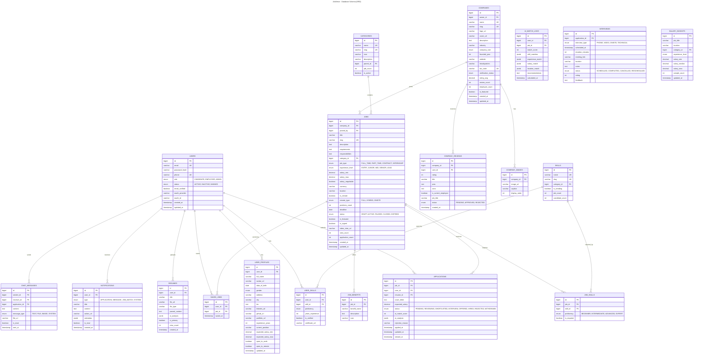

```mermaid
---
title: JobVerse - Database Schema (ERD)
---
erDiagram
    USERS ||--o{ USER_PROFILES : has
    USERS ||--o{ RESUMES : uploads
    USERS ||--o{ APPLICATIONS : submits
    USERS ||--o{ SAVED_JOBS : saves
    USERS ||--o{ NOTIFICATIONS : receives
    USERS ||--o{ USER_SKILLS : has
    USERS ||--o{ CHAT_MESSAGES : sends

    COMPANIES ||--o{ JOBS : posts
    COMPANIES ||--o{ COMPANY_REVIEWS : receives
    COMPANIES ||--o{ COMPANY_IMAGES : has

    JOBS ||--o{ APPLICATIONS : receives
    JOBS ||--o{ SAVED_JOBS : saved_by
    JOBS ||--o{ JOB_SKILLS : requires
    JOBS ||--o{ JOB_BENEFITS : offers

    SKILLS ||--o{ USER_SKILLS : used_by
    SKILLS ||--o{ JOB_SKILLS : required_by

    CATEGORIES ||--o{ JOBS : contains

    USERS {
        bigint id PK
        varchar email UK
        varchar password_hash
        varchar phone UK
        enum role "CANDIDATE, EMPLOYER, ADMIN"
        enum status "ACTIVE, INACTIVE, BANNED"
        boolean email_verified
        varchar oauth_provider
        varchar oauth_id
        timestamp created_at
        timestamp updated_at
    }

    USER_PROFILES {
        bigint id PK
        bigint user_id FK
        varchar full_name
        varchar avatar_url
        date date_of_birth
        enum gender
        varchar address
        varchar city
        text bio
        varchar linkedin_url
        varchar github_url
        varchar portfolio_url
        int experience_years
        varchar current_position
        decimal expected_salary_min
        decimal expected_salary_max
        boolean open_to_work
        boolean open_to_remote
        timestamp updated_at
    }

    RESUMES {
        bigint id PK
        bigint user_id FK
        varchar title
        varchar file_url
        varchar file_type
        text parsed_content
        jsonb ai_analysis
        boolean is_primary
        int view_count
        timestamp created_at
    }

    COMPANIES {
        bigint id PK
        bigint owner_id FK
        varchar name UK
        varchar slug UK
        varchar logo_url
        varchar cover_url
        text description
        varchar industry
        enum company_size
        int founded_year
        varchar website
        varchar headquarters
        varchar tax_code UK
        enum verification_status
        decimal rating_avg
        int review_count
        int employee_count
        boolean is_featured
        timestamp created_at
        timestamp updated_at
    }

    COMPANY_IMAGES {
        bigint id PK
        bigint company_id FK
        varchar image_url
        varchar caption
        int display_order
    }

    COMPANY_REVIEWS {
        bigint id PK
        bigint company_id FK
        bigint user_id FK
        int rating
        varchar title
        text pros
        text cons
        boolean is_current_employee
        varchar job_title
        enum status "PENDING, APPROVED, REJECTED"
        timestamp created_at
    }

    JOBS {
        bigint id PK
        bigint company_id FK
        bigint posted_by FK
        varchar title
        varchar slug UK
        text description
        text requirements
        text responsibilities
        bigint category_id FK
        enum job_type "FULL_TIME, PART_TIME, CONTRACT, INTERNSHIP"
        enum experience_level "ENTRY, JUNIOR, MID, SENIOR, LEAD"
        decimal salary_min
        decimal salary_max
        boolean salary_negotiable
        varchar currency
        varchar location
        boolean is_remote
        enum remote_type "FULL, HYBRID, ONSITE"
        int positions_count
        date deadline
        enum status "DRAFT, ACTIVE, PAUSED, CLOSED, EXPIRED"
        boolean is_featured
        boolean is_urgent
        varchar video_intro_url
        int view_count
        int application_count
        timestamp created_at
        timestamp updated_at
    }

    JOB_SKILLS {
        bigint id PK
        bigint job_id FK
        bigint skill_id FK
        enum proficiency "BEGINNER, INTERMEDIATE, ADVANCED, EXPERT"
        boolean is_required
    }

    JOB_BENEFITS {
        bigint id PK
        bigint job_id FK
        varchar benefit_name
        text description
        varchar icon
    }

    CATEGORIES {
        bigint id PK
        varchar name UK
        varchar slug UK
        varchar icon
        varchar description
        bigint parent_id FK
        int job_count
        boolean is_active
    }

    SKILLS {
        bigint id PK
        varchar name UK
        varchar slug UK
        bigint category_id FK
        boolean is_trending
        int job_count
        int candidate_count
    }

    USER_SKILLS {
        bigint id PK
        bigint user_id FK
        bigint skill_id FK
        enum proficiency
        int years_experience
        boolean is_verified
        varchar certificate_url
    }

    APPLICATIONS {
        bigint id PK
        bigint job_id FK
        bigint user_id FK
        bigint resume_id FK
        text cover_letter
        decimal expected_salary
        enum status "PENDING, REVIEWING, SHORTLISTED, INTERVIEW, OFFERED, HIRED, REJECTED, WITHDRAWN"
        int ai_match_score
        jsonb ai_analysis
        varchar rejection_reason
        timestamp applied_at
        timestamp updated_at
        timestamp viewed_at
    }

    SAVED_JOBS {
        bigint id PK
        bigint user_id FK
        bigint job_id FK
        timestamp saved_at
    }

    NOTIFICATIONS {
        bigint id PK
        bigint user_id FK
        enum type "APPLICATION, MESSAGE, JOB_MATCH, SYSTEM"
        varchar title
        text content
        varchar action_url
        jsonb metadata
        boolean is_read
        timestamp created_at
    }

    CHAT_MESSAGES {
        bigint id PK
        bigint sender_id FK
        bigint receiver_id FK
        bigint application_id FK
        text content
        enum message_type "TEXT, FILE, IMAGE, SYSTEM"
        varchar file_url
        boolean is_read
        timestamp sent_at
    }

    AI_MATCH_LOGS {
        bigint id PK
        bigint user_id FK
        bigint job_id FK
        int match_score
        jsonb skill_matches
        jsonb experience_match
        jsonb salary_match
        jsonb location_match
        text recommendations
        timestamp calculated_at
    }

    INTERVIEWS {
        bigint id PK
        bigint application_id FK
        enum interview_type "PHONE, VIDEO, ONSITE, TECHNICAL"
        timestamp scheduled_at
        int duration_minutes
        varchar meeting_link
        varchar location
        text notes
        enum status "SCHEDULED, COMPLETED, CANCELLED, RESCHEDULED"
        int rating
        text feedback
    }

    SALARY_INSIGHTS {
        bigint id PK
        varchar job_title
        varchar location
        bigint category_id FK
        enum experience_level
        decimal salary_min
        decimal salary_median
        decimal salary_max
        int sample_count
        timestamp updated_at
    }
```
