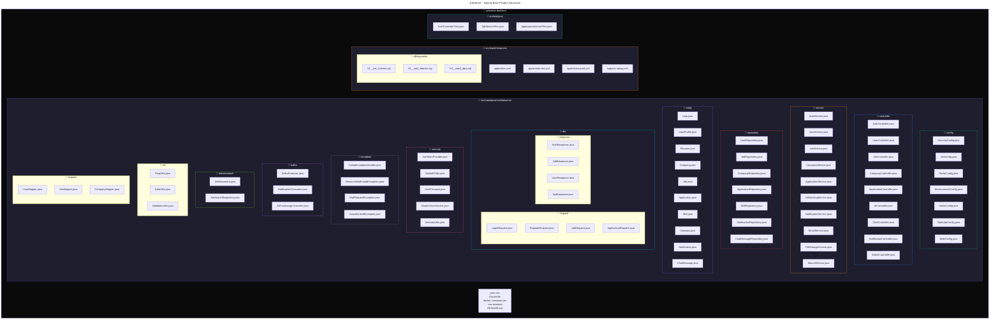

```mermaid
---
title: JobVerse - Spring Boot Project Structure
---
flowchart TB
    subgraph ROOT["📁 jobverse-backend"]
        subgraph SRC["📁 src/main/java/com/jobverse"]
            subgraph CONFIG["📁 config"]
                C1["SecurityConfig.java"]
                C2["JwtConfig.java"]
                C3["RedisConfig.java"]
                C4["ElasticsearchConfig.java"]
                C5["KafkaConfig.java"]
                C6["OpenApiConfig.java"]
                C7["WebConfig.java"]
            end

            subgraph CONTROLLER["📁 controller"]
                CT1["AuthController.java"]
                CT2["UserController.java"]
                CT3["JobController.java"]
                CT4["CompanyController.java"]
                CT5["ApplicationController.java"]
                CT6["AIController.java"]
                CT7["ChatController.java"]
                CT8["NotificationController.java"]
                CT9["AdminController.java"]
            end

            subgraph SERVICE["📁 service"]
                S1["AuthService.java"]
                S2["UserService.java"]
                S3["JobService.java"]
                S4["CompanyService.java"]
                S5["ApplicationService.java"]
                S6["AIMatchingService.java"]
                S7["NotificationService.java"]
                S8["EmailService.java"]
                S9["FileStorageService.java"]
                S10["SearchService.java"]
            end

            subgraph REPOSITORY["📁 repository"]
                R1["UserRepository.java"]
                R2["JobRepository.java"]
                R3["CompanyRepository.java"]
                R4["ApplicationRepository.java"]
                R5["SkillRepository.java"]
                R6["NotificationRepository.java"]
                R7["ChatMessageRepository.java"]
            end

            subgraph ENTITY["📁 entity"]
                E1["User.java"]
                E2["UserProfile.java"]
                E3["Resume.java"]
                E4["Company.java"]
                E5["Job.java"]
                E6["Application.java"]
                E7["Skill.java"]
                E8["Category.java"]
                E9["Notification.java"]
                E10["ChatMessage.java"]
            end

            subgraph DTO["📁 dto"]
                subgraph REQ["📁 request"]
                    D1["LoginRequest.java"]
                    D2["RegisterRequest.java"]
                    D3["JobRequest.java"]
                    D4["ApplicationRequest.java"]
                end
                subgraph RES["📁 response"]
                    D5["AuthResponse.java"]
                    D6["JobResponse.java"]
                    D7["UserResponse.java"]
                    D8["ApiResponse.java"]
                end
            end

            subgraph SECURITY["📁 security"]
                SE1["JwtTokenProvider.java"]
                SE2["JwtAuthFilter.java"]
                SE3["UserPrincipal.java"]
                SE4["OAuth2UserService.java"]
                SE5["SecurityUtils.java"]
            end

            subgraph EXCEPTION["📁 exception"]
                EX1["GlobalExceptionHandler.java"]
                EX2["ResourceNotFoundException.java"]
                EX3["BadRequestException.java"]
                EX4["UnauthorizedException.java"]
            end

            subgraph KAFKA["📁 kafka"]
                K1["KafkaProducer.java"]
                K2["NotificationConsumer.java"]
                K3["AIProcessingConsumer.java"]
            end

            subgraph ELASTICSEARCH["📁 elasticsearch"]
                ES1["JobDocument.java"]
                ES2["JobSearchRepository.java"]
            end

            subgraph UTIL["📁 util"]
                UT1["SlugUtils.java"]
                UT2["DateUtils.java"]
                UT3["ValidationUtils.java"]
            end

            subgraph MAPPER["📁 mapper"]
                M1["UserMapper.java"]
                M2["JobMapper.java"]
                M3["CompanyMapper.java"]
            end
        end

        subgraph RESOURCES["📁 src/main/resources"]
            RS1["application.yml"]
            RS2["application-dev.yml"]
            RS3["application-prod.yml"]
            RS4["logback-spring.xml"]
            subgraph MIGRATION["📁 db/migration"]
                MG1["V1__init_schema.sql"]
                MG2["V2__add_indexes.sql"]
                MG3["V3__seed_data.sql"]
            end
        end

        subgraph TEST["📁 src/test/java"]
            T1["AuthControllerTest.java"]
            T2["JobServiceTest.java"]
            T3["ApplicationServiceTest.java"]
        end

        ROOT_FILES["pom.xml<br/>Dockerfile<br/>docker-compose.yml<br/>.env.example<br/>README.md"]
    end

    style ROOT fill:#0a0a0b,stroke:#8b5cf6,color:#fff
    style SRC fill:#1e1e2e,stroke:#6366f1,color:#fff
    style CONFIG fill:#1e1e2e,stroke:#10b981,color:#fff
    style CONTROLLER fill:#1e1e2e,stroke:#3b82f6,color:#fff
    style SERVICE fill:#1e1e2e,stroke:#f59e0b,color:#fff
    style REPOSITORY fill:#1e1e2e,stroke:#ef4444,color:#fff
    style ENTITY fill:#1e1e2e,stroke:#8b5cf6,color:#fff
    style DTO fill:#1e1e2e,stroke:#06b6d4,color:#fff
    style SECURITY fill:#1e1e2e,stroke:#ec4899,color:#fff
    style EXCEPTION fill:#1e1e2e,stroke:#64748b,color:#fff
    style KAFKA fill:#1e1e2e,stroke:#a855f7,color:#fff
    style ELASTICSEARCH fill:#1e1e2e,stroke:#84cc16,color:#fff
    style RESOURCES fill:#1e1e2e,stroke:#f97316,color:#fff
    style TEST fill:#1e1e2e,stroke:#14b8a6,color:#fff
```
