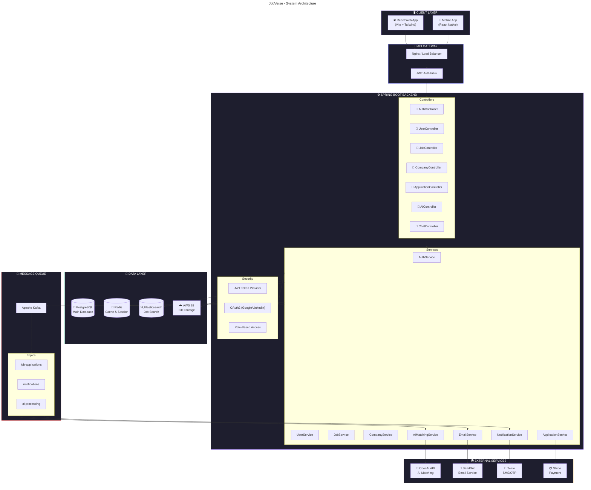

```mermaid
---
title: JobVerse - System Architecture
---
flowchart TB
    subgraph Client["🖥️ CLIENT LAYER"]
        WEB["🌐 React Web App<br/>(Vite + Tailwind)"]
        MOBILE["📱 Mobile App<br/>(React Native)"]
    end

    subgraph Gateway["🚪 API GATEWAY"]
        NGINX["Nginx / Load Balancer"]
        AUTH_FILTER["JWT Auth Filter"]
    end

    subgraph Backend["⚙️ SPRING BOOT BACKEND"]
        subgraph Controllers["Controllers"]
            AUTH_CTRL["🔐 AuthController"]
            USER_CTRL["👤 UserController"]
            JOB_CTRL["💼 JobController"]
            COMPANY_CTRL["🏢 CompanyController"]
            APP_CTRL["📝 ApplicationController"]
            AI_CTRL["🤖 AIController"]
            CHAT_CTRL["💬 ChatController"]
        end

        subgraph Services["Services"]
            AUTH_SVC["AuthService"]
            USER_SVC["UserService"]
            JOB_SVC["JobService"]
            COMPANY_SVC["CompanyService"]
            APP_SVC["ApplicationService"]
            AI_SVC["AIMatchingService"]
            NOTIFY_SVC["NotificationService"]
            EMAIL_SVC["EmailService"]
        end

        subgraph Security["Security"]
            JWT["JWT Token Provider"]
            OAUTH["OAuth2 (Google/LinkedIn)"]
            RBAC["Role-Based Access"]
        end
    end

    subgraph Data["💾 DATA LAYER"]
        POSTGRES[("🐘 PostgreSQL<br/>Main Database")]
        REDIS[("🔴 Redis<br/>Cache & Session")]
        ELASTIC[("🔍 Elasticsearch<br/>Job Search")]
        S3["☁️ AWS S3<br/>File Storage"]
    end

    subgraph External["🌍 EXTERNAL SERVICES"]
        AI_API["🧠 OpenAI API<br/>AI Matching"]
        MAIL["📧 SendGrid<br/>Email Service"]
        SMS["📱 Twilio<br/>SMS/OTP"]
        PAYMENT["💳 Stripe<br/>Payment"]
    end

    subgraph Queue["📨 MESSAGE QUEUE"]
        KAFKA["Apache Kafka"]
        subgraph Topics["Topics"]
            T1["job-applications"]
            T2["notifications"]
            T3["ai-processing"]
        end
    end

    WEB --> NGINX
    MOBILE --> NGINX
    NGINX --> AUTH_FILTER
    AUTH_FILTER --> Controllers

    Controllers --> Services
    Services --> Security
    Services --> POSTGRES
    Services --> REDIS
    Services --> ELASTIC
    Services --> S3
    Services --> KAFKA

    KAFKA --> Topics
    Topics --> NOTIFY_SVC
    Topics --> AI_SVC
    Topics --> EMAIL_SVC

    AI_SVC --> AI_API
    EMAIL_SVC --> MAIL
    NOTIFY_SVC --> SMS
    APP_SVC --> PAYMENT

    style Client fill:#1e1e2e,stroke:#8b5cf6,color:#fff
    style Gateway fill:#1e1e2e,stroke:#6366f1,color:#fff
    style Backend fill:#1e1e2e,stroke:#8b5cf6,color:#fff
    style Data fill:#1e1e2e,stroke:#10b981,color:#fff
    style External fill:#1e1e2e,stroke:#f59e0b,color:#fff
    style Queue fill:#1e1e2e,stroke:#ef4444,color:#fff
```
